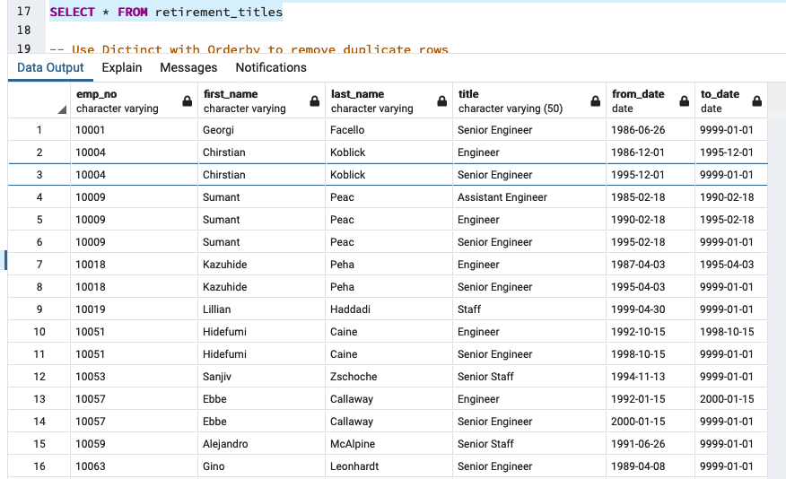
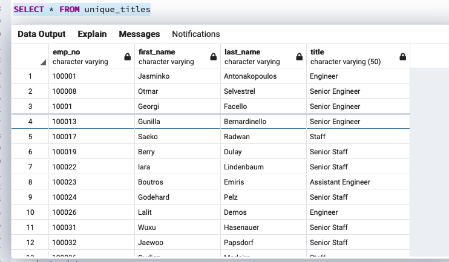
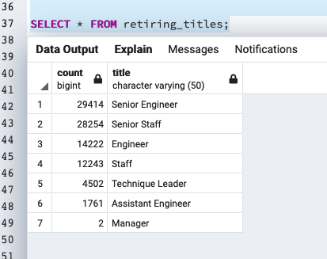
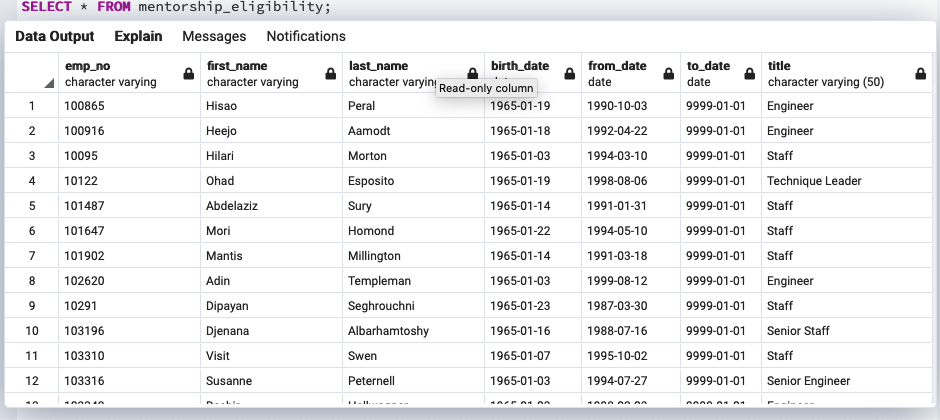

## Pewlett_Hackard_Analysis
module 7 SQL

### Overview of the analysis:
 

The purpose of this module is to create ERDs, import data into a database, troubleshoot errors, and create queries to analyze Pewlett Hackard's employee information. Given the data from Pewlett Hackard, we were able to determine the number of retiring employees per title and identify employees who are eligible to participate in a mentorship program.

### Results:
       
* retirement titles shows us all employees, current and retired, born between 1952 and 1955 ordered by employee number
  
* unique titles shows us employee information sorted by the employee number in ascending order and by the last date in descending order of the most                recent title.
  
 * retiring tables is unique tables grouped by titles 
  
 * lastly, mentorship eligibility combines employees, department employees, and our titles tables to show us current employees who are eligible to participate in a mentorship program. They must be born between January 1, 1965 and December 31, 1965. 
  

### Summary:
How many roles will need to be filled as the "silver tsunami" begins to make an impact?

According to our data, eventually there will need to be 90,398 roles that need to be filled as a result of the silver tsunami.
   
Are there enough qualified, retirement-ready employees in the departments to mentor the next generation of Pewlett Hackard employees?

There are currently only 1,549 Pewlett Hackard employees qualified to mentor the next generation. This is a huge shortage, so the faster Pewlett Hackard can hire and prepare for the silver tsunami, the more beneficial it is for their future.
